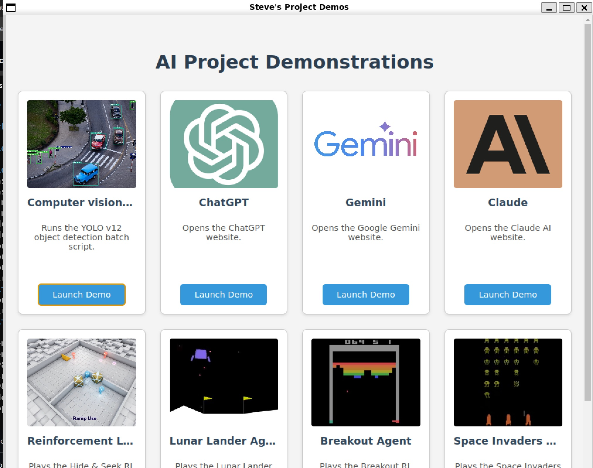

# Steve's Project Demos

This is an Electron application designed to launch and showcase a variety of project demos. It provides a simple and organized interface for running different scripts, opening web pages, and playing video demonstrations.



## Features

This application can launch a variety of demos, including:

*   **Computer Vision:**
    *   Object detection with YOLO v12.
*   **Large Language Models:**
    *   Quick access to ChatGPT, Google Gemini, and Claude.
*   **Reinforcement Learning:**
    *   Video demonstrations of agents playing games like Hide & Seek, Lunar Lander, Breakout, and Space Invaders.

## Technologies Used

*   [Electron](https://www.electronjs.org/)
*   [React](https://reactjs.org/)
*   [TypeScript](https://www.typescriptlang.org/)
*   [Vite](https://vitejs.dev/)
*   [Electron Forge](https://www.electronforge.io/)

## Getting Started

These instructions will get you a copy of the project up and running on your local machine for development and testing purposes.

### Prerequisites

You need to have [Node.js](https://nodejs.org/) and npm installed on your system.

### Installing

1.  Clone the repository:
    ```sh
    git clone https://github.com/sdmeers/demo_app
    cd demo_app
    ```
2.  Install the dependencies:
    ```sh
    npm install
    ```

### Running the Application

To start the application in development mode, run:

```sh
npm start
```

### Building the Application

To create a packaged application for your platform, run:

```sh
npm run make
```

This will generate the distributable files in the `out` directory.

## License

This project is licensed under the MIT License - see the [LICENSE](LICENSE) file for details.
